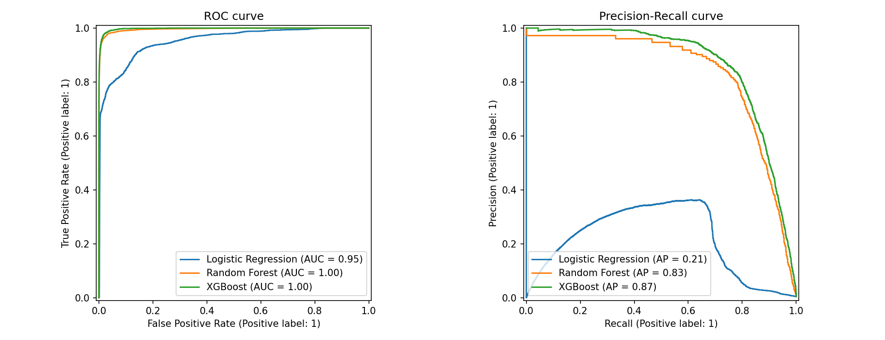
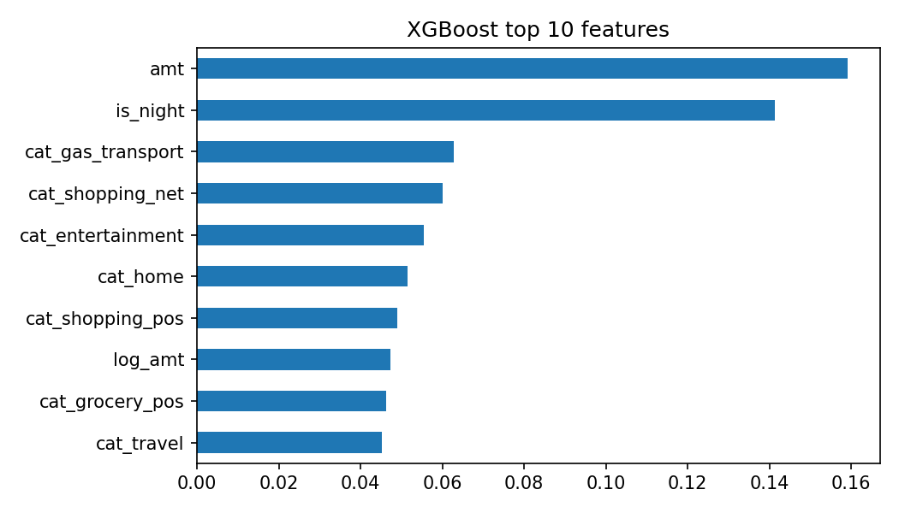

# Credit Card Fraud Detection

Binary classification of fraudulent credit card transactions using Logistic Regression, Random Forest and XGBoost, with class-imbalance handling (under-sampling + SMOTE) and evaluation focused on the fraud class.

## Dataset

[Credit Card Transactions Fraud Detection Dataset](https://www.kaggle.com/datasets/kartik2112/fraud-detection) (Kaggle, generated with the Sparkov simulator).

| | Rows | Fraud cases | Fraud rate |
|---|---|---|---|
| Train (`fraudTrain.csv`) | [1296675] | [555719] | [0.58]% |
| Test (`fraudTest.csv`) | 555,719 | 2,145 | 0.39% |

The data is **simulated**, not real bank data. It is not included in this repository (file size); download it from the Kaggle link above.

## Approach

1. **Feature engineering**
   - Distance between customer and merchant (haversine formula)
   - Hour of day, night-time flag, day of week, month
   - Customer age (from date of birth)
   - Transaction amount and log-amount
   - Merchant category (one-hot), gender, city population
   - Identifier and free-text columns (card number, transaction ID, names, street) were dropped: they have no predictive value and can cause leakage.
2. **Class imbalance**
   - Under-sampling of the majority class, then SMOTE on the minority class.
   - Applied to the **training data only**. The test set keeps its real class distribution.
3. **Models**
   - Logistic Regression (baseline, with feature scaling)
   - Random Forest (200 trees)
   - XGBoost (300 trees)
4. **Evaluation**
   - AUC-ROC, PR-AUC, precision, recall and F1 on the fraud class.
   - Uses the provided `fraudTest.csv`, which is split from the training data by time, so it mimics predicting future fraud from past data.

## Results

Test set, decision threshold 0.5, fraud class:

| Model | AUC-ROC | PR-AUC | Precision | Recall | F1 |
|---|---|---|---|---|---|
| Logistic Regression | 0.9529 | 0.2091 | 0.1893 | 0.7012 | 0.2981 |
| Random Forest | 0.9960 | 0.8329 | 0.3914 | 0.9142 | 0.5481 |
| **XGBoost** | **0.9979** | **0.8658** | **0.4002** | **0.9259** | **0.5588** |

Confusion matrix counts on the test set:

| Model | Frauds caught (TP) | Frauds missed (FN) | False alarms (FP) | Correct legitimate (TN) |
|---|---|---|---|---|
| Logistic Regression | 1,504 | 641 | 6,441 | 547,133 |
| Random Forest | 1,961 | 184 | 3,049 | 550,525 |
| XGBoost | 1,986 | 159 | 2,977 | 550,597 |





## Key takeaways

- **Accuracy is misleading here.** With ~0.4% fraud, a model that always predicts "not fraud" is ~99.6% accurate and catches nothing. Precision, recall, F1 and PR-AUC are the primary metrics.
- **AUC-ROC can look good on imbalanced data.** Logistic Regression has an AUC-ROC of 0.95 but a PR-AUC of only 0.21; the ensembles reach 0.83 to 0.87 PR-AUC.
- **XGBoost was the best model**, catching about 93% of fraud while flagging about 0.5% of legitimate transactions.
- **Precision is about 40%.** The models were trained on resampled data where fraud is far more common than in reality, so they over-predict fraud at the default 0.5 threshold. Tuning the threshold on a validation set would trade some recall for higher precision, depending on the relative cost of missed fraud versus false alarms.

## Limitations

- Simulated data; performance on real transactions would likely be lower.
- Single train/test split; no cross-validation and no hyperparameter tuning.
- Default 0.5 decision threshold, not tuned to business cost.
- No real-time, drift-monitoring or explainability components (a production system would need them).

## Repository contents

| File | Description |
|---|---|
| `fraud_detection.ipynb` | Full notebook: features, resampling, training, evaluation, plots |
| `model_comparison.csv` | Results table |
| `roc_pr_curves.png` | ROC and Precision-Recall curves |
| `feature_importance.png` | XGBoost top-10 features |
| `requirements.txt` | Python dependencies |

## How to run

```bash
pip install -r requirements.txt
```

1. Download `fraudTrain.csv` and `fraudTest.csv` from the [Kaggle dataset](https://www.kaggle.com/datasets/kartik2112/fraud-detection) and place them next to the notebook.
2. Open `fraud_detection.ipynb` and run all cells (also runs as-is in a Kaggle notebook with the dataset attached).

## Tech stack

Python, pandas, NumPy, scikit-learn, imbalanced-learn, XGBoost, Matplotlib
